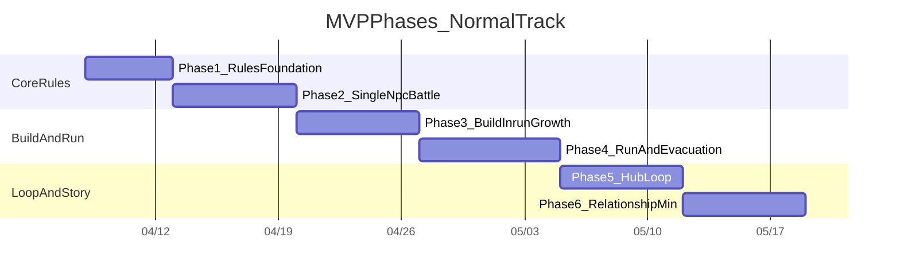

# MVP 技术方案与避坑计划

## Summary

## Current Progress (2026-04-28 / Update 7)
### Overall Status
- 当前主线进度：`Phase 7 附魔 MVP 基础完成，可进入验收/打磨`。
- 当前开发重点：把 `D6 构筑 + Run 内 BD + 附魔 + 装备` 的体验从“可玩”打磨到“更清楚、更好选、更有差异”。
- 当前可运行形态：`Hub -> Run -> 战斗/事件/商店/补给 -> 奖励选择 -> 后续战斗生效` 已具备基础闭环。

### Completed Since Update 6
- 数据导入噪音已收口：`content/csv/.gdignore` 保留，`*.csv.import` 与 `*.translation` 已移出版本管理，并在 `.gitignore` 中忽略。
- 附魔 MVP 已接入基础闭环：
  - `content/csv/enchantments.csv` 与 `content/generated/enchantments.json` 已存在。
  - `content/csv/enchant_pools.csv` 与 `content/generated/enchant_pools.json` 已存在。
  - 运行时绑定结构使用 `die_id + face_index + enchant_id + source + grant_run_id`。
  - Run 奖励已支持 `grant_enchant / replace_enchant / remove_enchant`。
  - 战斗规则层已读取附魔效果，并输出 `enchant_triggered` 日志。
  - 战斗 UI 已能在骰面说明中展示附魔名称与效果。
  - Run UI 已能展示当前附魔数量、附魔绑定位置，以及奖励将影响哪颗 D6 的哪一面。
- BD 奖励池已扩展：新增更多 `replace_die`、`upgrade_die`、角色专属附魔与高风险构筑选择。
- Run 事件已补取舍：稳妥回收、危险改造、付费附魔、Forge Needle 免费附魔路线。
- 敌人意图已开始针对 `mark / counter / summon / overload / negative / reroll` 关键词做压力测试。
- 装备系统已进入可验证状态：主动道具每场一次，`damaged` 装备弱于 `intact`，装备不会突破“每回合 3 颗 D6 全部使用”的骰子经济。

### In Progress
- Phase 7 后续打磨项：
  - Hub 层还没有正式的附魔仓库/长期附魔管理 UI。
  - 附魔数值还未做完整平衡，只保证规则闭环和可读性。
  - 关系系统后续可以解锁专属附魔池，但本轮只保留池结构与数据入口。
  - 敌人针对性已经有第一版标签和效果，仍需要更多战斗体验调参。

### Next Priority
1. 进行 Phase 7 手动验收与小修。
2. 打磨 Run/Hub 构筑可读性，尤其是“当前构筑为什么变强/变危险”。
3. 继续扩 Run 事件文本和敌人针对性数值。
4. 之后进入整体体验打磨：UI、节奏、数值、内容量。

## Current Progress (2026-04-26 / Update 6)
### Direction Adjustment
- Current development direction is now `D6 build + in-run BD + relationship-unlocked build content`.
- The build unit is `die_id`; UI and tests should treat a die as the editable object, with six faces shown as detail instead of loose build pieces.
- Run rewards now prioritize build-changing rewards: `add_die`, `replace_die`, `remove_negative`, and `upgrade_die`.
- Hub progression should gradually move away from long-term raw stat stacking and toward unlocking dice, upgrade branches, enchant pools, and relationship-specific build items.
- Phase 6 relationship rewards should be build-facing. Aurian relationship content should eventually unlock Aurian-specific dice/enchant/upgrade routes, not only permanent stats.
- Enchant has moved from reserved interface to `Phase 7 MVP implementation`; current work should finish the playable enchant loop before expanding story volume.

### Implemented This Update
- Hub build UI now presents equipped/reserve D6 dice and exposes face details for each `die_id`.
- Added regression coverage for D6 data integrity, deterministic die-id loadouts, and Run build rewards.
- Existing internal id `umbral_draxx` remains stable; display name remains `Aurian (Aorian)`.

### Immediate Priority
- Stabilize D6 build editing, Run build reward application, and data validation before expanding story volume.
- Finish Phase 7 enchant gameplay loop, then expand BD rewards, Run events, and targeted enemies.

## Current Progress (2026-04-25 / Update 5)
### Overall Status
- Current main progress: `Phase 6 MVP loop is connected`.
- Current development stage: `Relationship and story MVP is verifiable`.
- Current playable shape: `Hub -> Run -> Result -> Hub` can advance Aurian relationship nodes, and relationship rewards feed into later Aurian run setup as persistent growths.
- Current priority: expand relationship lines, add final Chinese story text, and improve the relationship UI presentation later.

### Phase 6 Implemented
- Added minimal story layer: `RelationshipState`, `RelationshipCatalog`, `RelationshipService`.
- Added table-driven content: `relationship_nodes.csv`, `relationship_rewards.csv`, `story_events.csv`.
- HubState now processes Run results, unlocks relationship nodes, records story events, and prevents duplicate rewards.
- Relationship rewards now affect gameplay: Aurian relationship rewards become persistent growths for future Aurian runs.
- Hub now has a `Relationship / Story` display area for relationship progress and latest unlock feedback.
- Black dragon display name is now `Aurian (Aorian)` while internal id `umbral_draxx` remains stable for combat/tests.

### Verification
- Local command: `godot --headless --path 'G:\FurrySTS' --quit`
- Result: pass.
- New tests: `relationship_trigger_test`, `relationship_reward_test`, `story_integration_test`.
- Known non-blocking warning: hero win-rate balance is still out of range and remains a later tuning task.

### Remaining After Phase 6 MVP
- Story text is still minimal placeholder text.
- Only Aurian has a relationship line; Cyan and Helios are not connected yet.
- Relationship UI is still a text panel, not a final character interaction screen.

## Current Progress（2026-04-25 / Update 3）

### Overall Status
- 当前主线进度：`Phase 5 已进入可运行闭环`
- 当前开发阶段：`Phase 5 进行中`
- 当前可运行形态：项目启动后进入 `Hub`，可选择出战角色、配置基础骰面、消费 Credits 购买局外成长，然后进入 `Run`；Run 结束后会回到 Hub 并写入结算。
- 当前优先事项：继续把 Hub 的局外成长、构筑编辑和结算信息从“最小可用”推进到“稳定可玩”，再进入 Phase 6 关系系统。

### Completed Since Last Snapshot
- `Phase 4` 已具备主闭环能力：
  - Run 路线可按 seed 生成并展示
  - 战斗节点会进入真实可视化战斗界面
  - 战斗结束后可返回 Run，并继续奖励选择与路线推进
  - 撤离、完成、失败三类 Run 结果已有最小结算出口

- `Phase 5` 已补最小 Hub 闭环：
  - 新增 `HubState`：保存累计 Credits、Run 次数、完成/撤离/失败统计、当前英雄、上次 Run 结果
  - 新增 `HubVisualizer`：展示 Hub 状态、角色选择、局外成长、基础构筑、上次 Run 结算
  - 新增 `RootFlow`：负责 `Hub -> Run -> Hub` 场景切换
  - `RunVisualizer` 新增 `run_finished` 信号，Run 结束时会输出标准 `RunResult`
  - `RunResult` 已扩展为包含 `hero_id`、`node_results` 等 Hub 可消费字段

### Newly Implemented Gameplay Surfaces
- 局外资源消费：
  - Hub 可用 `Credits` 购买最小局外成长
  - 当前成长包括：最大生命、开场护甲、资源上限
  - 购买后的成长会写入下一局 Run 的初始化 setup

- 基础构筑编辑：
  - Hub 为每个英雄维护一套基础骰面 loadout
  - 当前最小规则：默认 6 槽，最低保留 4 个骰面
  - 下一局 Run 会按当前英雄 loadout 过滤骰池

- 结算信息回流：
  - Hub 会展示上次 Run 的结果类型、清理节点数、带回 Credits、获得成长数
  - `node_results` 已进入 `RunResult`，后续可继续扩展为更完整的战报面板

### Verification
- 当前 smoke 已覆盖：
  - `combat_rules`
  - `battle_flow`
  - `inrun_growth`
  - `battle_visualizer_ui`
  - `reward_draft_flow`
  - `route_generation`
  - `run_progression`
  - `evacuation_result`
  - `run_visualizer_ui`
  - `hub_loop`
- 最新本地验证命令：
  - `godot --headless --path 'G:\FurrySTS' --quit`
- 验证结果：通过；仍存在已知平衡警告，主要是三名角色胜率差距较大。

### Known Gaps
- Phase 5 尚未完成最终 DoD：
  - Hub 构筑编辑仍是最小按钮式交互，没有完整卡牌/骰面详情面板
  - 局外成长仍是硬编码最小定义，尚未表驱动
  - Hub 状态尚未持久化到存档
  - Credits 消费数值未平衡
  - Run 结算战报还比较简略
- Phase 6 尚未开始：
  - 关系系统
  - 剧情事件
  - NPC 关系奖励与解锁

## Current Progress（2026-04-22 / Update 2）

### Phase 4 Snapshot
- 当前主线进度：`Phase 3 已完成并验收`
- 当前开发阶段：`Phase 4 进行中`
- 当前新增状态：`Run -> 战斗 -> 返回 Run` 的最小闭环已经接通。
- 当前可运行形态：
  - Run 层已具备路线预览、当前节点说明、撤离入口、奖励领取入口。
  - 战斗节点不再是纯自动结算，而是会进入真实的可视化战斗界面。
  - 战斗结束后会回写节点结果，再返回 Run 继续推进。
- 当前已补验证：
  - `battle_visualizer_ui_test.gd`
  - `run_visualizer_ui_test.gd`
  - `smoke_runner.gd` 已覆盖 Run 进入战斗、战斗返回、奖励领取后的推进流程。

### Phase 4 Remaining
- 当前仍未完成：
  - 更完整的路线表现与节点差异化演出
  - 更强的事件节点交互表现
  - Run 结果与后续 Hub 闭环的正式接线

### Phase 5 Snapshot
- 当前状态：`Phase 5 已启动`
- 当前新增内容：
  - 已补最小 `HubState`
  - 已补最小 `HubVisualizer`
  - 已补 `RootFlow`，用于切换 `Hub -> Run -> Hub`
  - `Run` 结束时现在会抛出标准结果，Hub 可接收并累计局外 Credits 统计
- 当前范围说明：
  - 这一版 Hub 仍是最小功能型，不包含正式构筑编辑、局外成长购买或关系系统入口
  - 但主闭环 `Hub -> Run -> 结算 -> Hub` 已具备可运行骨架

## Current Progress（2026-04-22）

### Overall Status
- 当前主线进度：`Phase 2 完成并已验收`
- 当前开发阶段：`Phase 3 进行中`
- 当前可运行形态：`单 NPC vs 单体 Boss` 的可视化战斗原型已成立，可直接在 Godot 内运行验证。
- 当前优先事项：先把 `Phase 3` 的“战后奖励 -> 局内成长 -> 下一场生效”闭环补完整，再进入 Run 层。

### Completed
- `Phase 1` 已完成：
  - 规则底座已建立：`CombatState`、`CombatUnit`、`BattleSimulator`、`EffectResolver`
  - 随机流已隔离：至少区分 `dice` / `ai`，并具备 seed 复现能力
  - 行动日志与关键事件记录已可用于复盘与测试
  - 基础 smoke/test 链路已接入主流程

- `Phase 2` 已完成并验收：
  - 单 NPC 战斗循环已成立：掷骰、选骰、行动、敌方回合、胜负结算
  - 已有至少 3 个敌人模板用于战斗覆盖
  - 已有可视化战斗界面，支持手动操作而非纯自动策略
  - 战斗 UI 已补充技能名、效果描述、日志说明，适合未玩过的人理解
  - 战斗 UI 已完成一轮中文化
  - 重骰机制已升级为“选择一个或多个骰子后统一重骰”，提高策略性
  - 已增加可视化按钮交互 smoke，覆盖选骰、重骰、结束回合等主要路径

### In Progress
- `Phase 3` 已开始，但尚未达到 DoD：
  - 已补基础数据表：`rewards.csv`、`inrun_growth.csv`
  - 已补最小运行时状态：`run_progress_state.gd`
  - 已补最小自动化验证：`inrun_growth_test.gd`
  - 当前仍缺少完整玩家闭环：
    - 战后奖励选择界面或奖励消费入口
    - 奖励正式写入构筑/成长状态
    - 成长效果在后续战斗中稳定生效
    - 更完整的状态效果系统与构筑差异验证

### Not Started Yet
- `Phase 4` Run 路线与撤离
- `Phase 5` Hub -> Run -> 结算 -> Hub 闭环
- `Phase 6` 关系与剧情最小实现

### Acceptance Snapshot
- 当前已验收模块：
  - 基础战斗模块
  - 战斗可视化模块
  - 中文说明与可操作性基础体验
- 当前未验收模块：
  - 局内成长闭环
  - Run 路线推进
  - Hub 闭环
  - 关系系统
- MVP 主技术栈采用 `Godot + GDScript`，不使用纯 C++ 作为主开发语言。
- 内容工作流采用 `CSV 表驱动 + 导入生成游戏内数据`，保证后续平衡、扩内容和批量迭代可控。
- 战斗采用 `纯数据模拟核心`，表现层只消费结果，不允许把规则写死在场景节点和动画回调里。
- 规则层从第一天开始支持 `自动测试 + 随机种子复现`，这是避免 STS 类项目后期失控的关键。

## Key Technical Decisions
### 1. 主技术栈
- `Godot` 负责工程框架、UI、场景、流程控制、资源组织和导入管线。
- `GDScript` 负责绝大多数 MVP 逻辑，优先换取迭代速度。
- `C++ / GDExtension` 只作为后续热点优化手段，不进入 MVP 主流程设计。
- 默认首发平台按 `PC` 设计，输入和 UI 先以键鼠为主，手柄只做结构预留。

### 2. 内容层架构
- 所有核心内容先按表驱动设计，至少包括：
  - NPC 定义
  - 骰子定义
  - 敌人定义
  - 状态效果定义
  - Run 节点与奖励定义
  - 关系节点与解锁条件
- MVP 的主表格式用 `CSV`。
- 导入层负责把 CSV 转成 Godot 内部可消费的数据对象，运行时不直接依赖原始表结构。
- 复杂文本或分支事件如果 CSV 明显不适配，可在后续补 `JSON`，但 MVP 先不引入混合格式复杂度。

### 3. 规则层与表现层分离
- 战斗规则层必须是 `纯数据模拟核心`：
  - 输入：战斗状态、角色数据、敌人数据、随机种子、玩家决策
  - 输出：状态变化、行动结果、日志事件、结算结果
- UI 层只负责：
  - 展示当前状态
  - 收集玩家输入
  - 回放规则层输出的结果
- 不允许把伤害、Buff、结算顺序、回合推进写在动画回调、按钮事件或场景节点副作用里。
- Run 结算、Hub 成长、关系解锁也要尽量遵守相同原则：规则判断和展示分离。

### 4. 随机与复现
- 从 MVP 开始统一使用带种子的随机系统。
- 至少拆分两层随机源：
  - Run 层随机：地图节点、奖励、事件
  - 战斗层随机：投骰、敌方行为变体、战斗内掉落
- 每次 Run 必须能记录 seed 和关键决策，支持基本重放或复现。
- 调试日志中要能看到关键随机结果和来源，避免“同样流程无法复现”的排查死局。

### 5. 数据结构预留
- 虽然 MVP 先做 `1 名 NPC 上场`，但这些结构必须按未来多角色扩展设计：
  - 出战单位容器
  - 行动顺序队列
  - 目标选择接口
  - 状态效果挂载
  - 骰池归属
  - 局内临时成长归属
- 主角数据和战斗角色数据必须从一开始拆开：
  - `主角数据`：关系、剧情、解锁、Hub 权限
  - `NPC战斗数据`：生命、骰池、状态、成长、装备、临时效果
- 这样后面从 `1人上场` 扩到 `2-3人上场` 时，不需要推倒战斗底层。

## Important Interfaces / Types
- 角色数据必须从一开始拆成两类：
  - `主角数据`：关系、剧情状态、Hub 权限、解锁进度。
  - `战斗角色数据`：生命、骰池、状态、成长、装备、局内临时效果。
- 战斗层接口必须独立于 Hub 和剧情，至少包含：
  - 单位属性
  - 骰子结果与行动解析
  - 状态与回合结算
  - 胜负与战后结果
- Run 层必须独立保存：
  - 当前路线进度
  - 当前角色状态
  - 临时成长
  - 已获取奖励
  - 撤离可用性
- 结算层必须统一输出：
  - 通关 / 撤离 / 失败结果
  - 带回资源
  - 局外解锁
  - 关系或剧情触发
- Hub 层只消费结算结果，不直接依赖战斗内部过程，避免后续难扩展。

## Implementation Order
### 1. 规则底座
- 先搭建纯数据核心的基础模块：
  - 随机系统
  - 通用状态容器
  - 回合流程状态机
  - 行动解析与结算日志
- 同时确定 CSV 导入管线最小版本，至少能导入 NPC、骰子和敌人三类数据。
- 先不做 UI，只做最小命令行式或调试输出验证规则层成立。

#### Phase 1 文件级实施清单
- `scripts/core/`
  - `rng_streams.gd`：统一随机入口，最少拆分 `run_rng` 与 `combat_rng` 两路。
  - `action_log_entry.gd`、`action_logger.gd`：定义标准日志事件结构（行动前后状态、随机结果、结算结果）。
  - `turn_state_machine.gd`（若不存在则新增）：统一回合推进状态，禁止在 UI 或场景节点里推进规则。
- `scripts/combat/`
  - `combat_state.gd`：收敛战斗输入/输出状态（单位列表、回合计数、胜负标记、临时效果容器）。
  - `combat_unit.gd`：最小单位数据结构（HP、资源、基础属性、骰池引用、状态挂载）。
  - `effect_resolver.gd`：确保攻击/防御/回复在规则层可纯函数式结算（或接近纯函数式）。
  - `battle_simulator.gd`：只编排流程，不直接写死业务规则。
- `scripts/content/`
  - `content_loader.gd`：维持“运行时消费统一对象，不直接依赖原始 CSV 列格式”。
  - `combat_catalog.gd`：建立 NPC/骰子/敌人三类索引，供战斗层只读查询。
  - `unit_factory.gd`：从内容对象构建战斗单位，避免战斗流程直接拼装 CSV 字段。
- `scripts/tests/`
  - `smoke_runner.gd`：挂最小 deterministic 验证。
  - 新增 `combat_rules_test.gd`（建议）：承载伤害/防御/回复/顺序/seed 一致性用例。

#### Phase 1 数据最小字段集（CSV）
- `content/csv/npcs.csv`
  - 必需：`id,name,base_hp,resource_type,resource_init,resource_cap`
  - 预留可选：`dice_pool`（可先用于初始化引用，不做复杂构筑）
- `content/csv/dice.csv`
  - 必需：`owner_id,face_id,effect_bundle_id,cost_type,cost_value,die_type`
  - 可选：`tags`（先只用于简单分类，不绑定复杂规则）
- `content/csv/enemies.csv`
  - 必需：`id,name,base_hp,atk_low,atk_high`
  - 可选：`bonus_every_turns,bonus_flat`（有余力再接）
- 暂缓到 Phase 3：`status_effects.csv` 的复杂持续机制字段（`duration,stack_rule,target/source` 的完整语义）

#### Phase 1 测试清单（必须自动化）
- 规则正确性
  - 基础伤害：伤害不会出现负值，死亡判定在预期回合触发。
  - 防御减伤：格挡优先吸收，溢出伤害再扣生命。
  - 回复边界：回复不超过上限，死亡单位不可被非法回复复活（除非显式机制支持）。
  - 回合顺序：玩家回合/敌人回合切换稳定，不重复结算或跳回合。
- 可复现性
  - 同一 seed + 同一决策输入 => 完全一致结果（胜负、关键日志、剩余 HP/资源）。
  - 不同 seed 在统计上产生可观测差异，但不破坏规则合法性。
- 安全失败
  - 缺失关键字段、空数据、非法数值时，返回可诊断错误并安全终止，不崩溃主流程。

#### Phase 1 完成定义（Definition of Done）
- 能在无 UI 条件下稳定跑通：`1 名 NPC vs 2-3 类基础敌人` 的最小战斗循环。
- `run_rng` 与 `combat_rng` 已分离，且日志能标注关键随机来源。
- 最小 CSV 导入链路可用：`npcs/dice/enemies` 三类数据可被统一加载并构建战斗对象。
- 自动测试可一键执行并稳定通过，至少覆盖：伤害、防御、回复、回合顺序、同 seed 一致性。
- 任何战斗规则改动都能通过日志与 seed 复现实验定位，不依赖手工 UI 点击排查。

### 2. 单 NPC 战斗原型
- 用导入后的数据驱动首个可玩战斗：
  - 1 名 NPC
  - 2-3 种基础敌人
  - 攻击、防御、回复、基础状态
  - 胜负判定和战后结果
- 此阶段同时建立第一批自动测试：
  - 基础伤害结算
  - 防御减伤
  - 回复边界
  - 回合顺序
  - 相同 seed 结果一致

#### Phase 2 文件级实施清单
- `scripts/combat/`
  - `battle_simulator.gd`：接入“玩家决策输入 -> 行动解析 -> 敌方行动 -> 回合结算”的完整单场循环。
  - `effect_resolver.gd`：补齐最小动作集合（攻击、防御、回复、基础状态触发）并统一结算顺序。
  - `combat_state.gd`：明确战斗阶段与胜负状态，保证中途终止与战后收敛路径稳定。
  - `enemy_intent.gd`（若不存在建议新增）：敌方意图生成与展示数据分离，避免散落在模拟器内。
- `scripts/content/`
  - `combat_catalog.gd`：按 `owner_id` 绑定 NPC 与骰池，保证单 NPC 能拿到完整可用面集合。
  - `unit_factory.gd`：把 NPC/Enemy 的内容对象实例化成战斗单位，统一初始资源与基础属性装配。
- `scripts/tests/`
  - `combat_rules_test.gd`：补成“规则断言”测试文件（不依赖 UI）。
  - `battle_flow_test.gd`（建议新增）：覆盖整场流程路径（正常胜利、失败、非法输入中断）。
  - `smoke_runner.gd`：接入一组“单 NPC vs 2-3 敌人模板”的冒烟编排。

#### Phase 2 数据最小字段集（扩展与约束）
- `content/csv/npcs.csv`
  - 增量必需：`id` 与 `dice.csv.owner_id` 的一对多关联必须唯一可追踪。
  - 建议约束：每个 MVP NPC 至少具备 `攻/防/回复` 三类可触发面（可通过 `effect_bundle_id` 映射保证）。
- `content/csv/dice.csv`
  - 增量必需：`effect_bundle_id` 必须能映射到有效结算动作；非法映射要在导入时报错。
  - 建议约束：`cost_type/cost_value` 先只支持最小集合（如 energy/stamina），避免提早引入多资源复杂度。
- `content/csv/enemies.csv`
  - 增量必需：首批 2-3 敌人需形成轻度行为差异（如攻击区间、节奏差异），不要求复杂技能表。
  - 建议约束：敌人行为先保留可解释性，便于 seed 复现排查。

#### Phase 2 测试清单（必须自动化）
- 整体战斗流程
  - 单 NPC 可独立完成整场战斗，且胜负都会落到合法结算分支。
  - 战斗结束后不会继续推进回合，不会重复触发战后结果。
- 决策与动作有效性
  - 玩家可选动作集合为空时，系统能安全处理（如防御/跳过默认行为），不崩溃。
  - 非法动作输入（不存在 face_id、资源不足）会被拒绝且日志可诊断。
- 最小可玩性验证
  - 攻击、防御、回复在对局中都能产生可观察且有意义的结果。
  - 不同骰面配置会显著影响战斗路径（至少在关键日志与结果分布上可区分）。
- 复现与回归
  - 同 seed + 同决策脚本可复现相同回合日志。
  - 修改任一核心规则后，回归测试可定位受影响断言点。

#### Phase 2 完成定义（Definition of Done）
- 已形成“可运行的最小单场战斗产品内核”：`1 名 NPC + 2-3 基础敌人 + 最小动作集 + 胜负结算`。
- 核心流程不依赖 UI 也可运行，UI 仅作为输入输出壳层。
- CSV 驱动链路已覆盖单场战斗所需全部最小数据，且非法数据会在导入或初始化阶段被拦截。
- 自动化测试与 smoke 在本地可稳定通过，且同 seed 可复现关键结果。
- 从日志可追踪每回合关键决策、关键随机值和结算结果，满足后续平衡调试需求。

### 3. 构筑与局内成长
- 在单战斗成立后，补上骰池替换、成长分支、局内强化。
- 导入表扩展到：
  - 状态效果
  - 奖励项
  - 临时成长项
- 自动测试补到：
  - 骰子替换后打法变化
  - Buff / Debuff 叠加
  - 成长效果在后续回合中的持续性

#### Phase 3 文件级实施清单
- `scripts/combat/`
  - `effect_resolver.gd`：扩展到可组合状态效果（Buff / Debuff / 持续回合）并固定触发时机。
  - `combat_state.gd`：加入局内成长挂载区（战斗内临时强化、一次性效果消耗记录）。
  - `combat_unit.gd`：支持单位级状态容器与持续效果生命周期（附加、刷新、移除）。
  - `dice_face_definition.gd`：补齐可用于构筑差异化的最小元信息（类型/标签/稀有度占位字段）。
- `scripts/content/`
  - `content_loader.gd`：扩展导入 `status_effects`、`rewards`、`inrun_growth` 三类数据对象。
  - `combat_catalog.gd`：新增状态效果与成长项索引（按 `effect_id` / `reward_id` / `growth_id`）。
  - `build_manager.gd`（建议新增）：管理局外已配置骰池与局内临时替换的差异合并逻辑。
- `scripts/run/`（若目录尚未建立可先最小创建）
  - `run_progress_state.gd`（建议新增）：记录本次 run 的临时强化、已获奖励、当前构筑变化快照。
- `scripts/tests/`
  - `status_effect_test.gd`（建议新增）：覆盖触发时机、叠加规则、持续回合。
  - `build_variation_test.gd`（建议新增）：验证不同骰池配置确实导致策略/结果差异。
  - `inrun_growth_test.gd`（建议新增）：验证临时成长跨战斗或跨节点保留与失效规则。

#### Phase 3 数据最小字段集（新增）
- `content/csv/status_effects.csv`
  - 必需：`effect_id,bundle_id,trigger,op_type,value,duration`
  - 建议最小叠加规则字段：`stack_rule`（如 replace/additive/cap）
  - 建议约束：同一 `bundle_id` 的效果执行顺序可确定（按行序或显式 priority）
- `content/csv/rewards.csv`（建议新增）
  - 必需：`reward_id,type,value,rarity,weight`
  - 可选：`condition_tag`（用于最小条件掉落或过滤）
- `content/csv/inrun_growth.csv`（建议新增）
  - 必需：`growth_id,type,target,delta,duration_scope`
  - 示例 `duration_scope`：`battle` / `run`
- `content/csv/dice.csv`（Phase 3 增量）
  - 建议新增：`rarity,upgrade_to,tags`
  - 用于最小构筑替换与成长反馈，不在本阶段引入复杂进化树编辑器。

#### Phase 3 测试清单（必须自动化）
- 状态效果系统
  - Buff / Debuff 在指定触发点触发（回合开始/结束、受击后、行动后）。
  - 持续回合正确递减并在到期时移除，不发生幽灵状态残留。
  - 叠加规则符合定义（replace/additive/cap）且顺序确定。
- 构筑有效性
  - 替换骰池后，行动选择分布与战斗结果分布有可观测变化。
  - 构筑非法配置（超上限、无效 face_id、重复冲突）会被拒绝并给出可诊断错误。
- 局内成长持续性
  - `duration_scope=battle` 的强化在战斗结束后清除。
  - `duration_scope=run` 的强化在 run 内保留，run 结束后清除或结算转化。
  - 一次性成长项使用后不会重复生效。
- 回归与复现
  - 引入状态效果后，Phase 1/2 的核心断言仍通过（不破坏基础战斗正确性）。
  - 同 seed + 同构筑 + 同决策在引入成长后仍可稳定复现。

#### Phase 3 完成定义（Definition of Done）
- 玩家可在战斗前或 run 中进行最小构筑调整，且能在对局中感知到打法差异。
- 状态效果已形成可配置、可测试、可复现的最小闭环（触发、持续、叠加、移除）。
- 局内成长（临时强化/奖励）可稳定生效，并按 `battle/run` 生命周期正确回收。
- 新增内容仍遵守“规则层与表现层分离”，UI 不承载规则副作用。
- 自动测试覆盖状态与成长关键路径，且不会回归破坏 Phase 1/2 的稳定性。

### 4. Run 系统与撤离
- 接入路线图、节点状态、Run 级资源记录和撤离判定。
- Run 层先只支持：
  - 普通战斗
  - 事件
  - 补给
  - 撤离
- 随机系统在这一步必须已经可复现，否则后面无法调平衡。
- 测试重点放在：
  - 路线推进状态
  - 临时成长跨节点保留
  - 撤离与失败结算差异
  - 同 seed 的路线生成一致性

#### Phase 4 文件级实施清单
- `scripts/run/`
  - `run_state.gd`（建议新增）：Run 全局状态容器（seed、当前节点、节点历史、可撤离标志、临时成长快照）。
  - `route_generator.gd`（建议新增）：分叉路线生成器，输入 seed 输出可复现节点图。
  - `node_resolver.gd`（建议新增）：节点执行分发（普通战斗/事件/补给/撤离）。
  - `evacuation_manager.gd`（建议新增）：撤离可用性判定与撤离结算入口。
  - `run_result.gd`（建议新增）：统一 run 结束输出结构（完成/撤离/失败）。
- `scripts/combat/`
  - `battle_simulator.gd`：输出战斗结束摘要给 Run 层消费（胜负、剩余状态、局内奖励、关键日志索引）。
- `scripts/content/`
  - `content_loader.gd`：扩展导入 `run_nodes` 与 `run_rewards` 数据。
  - `run_catalog.gd`（建议新增）：管理节点模板、事件池、奖励池及权重。
- `scripts/tests/`
  - `route_generation_test.gd`（建议新增）：验证同 seed 路线一致、不同 seed 有差异。
  - `run_progression_test.gd`（建议新增）：验证节点推进、分支选择、终止条件。
  - `evacuation_result_test.gd`（建议新增）：验证撤离/失败/完成三种结算差异。

#### Phase 4 数据最小字段集（新增）
- `content/csv/run_nodes.csv`（建议新增）
  - 必需：`node_id,node_type,weight,next_pool,allow_evac`
  - `node_type` MVP 固定四类：`battle,event,supply,evac`
  - `next_pool` 用于最小分叉控制，不引入复杂图编辑器
- `content/csv/run_rewards.csv`（建议新增）
  - 必需：`reward_id,reward_type,value,weight,source_node_type`
  - 用于节点后奖励抽取与结算统计
- `content/csv/events.csv`（建议新增）
  - 必需：`event_id,text_id,options,result_bundle_id`
  - MVP 先做轻量事件分支，不做复杂多阶段事件树
- `content/csv/run_rules.csv`（可选最小）
  - 建议：`rule_id,key,value`
  - 用于配置最大节点数、撤离开放轮次、基础奖励倍率

#### Phase 4 测试清单（必须自动化）
- 路线与节点
  - 同 seed 生成完全一致的路线结构与节点类型序列。
  - 不同 seed 生成可观测差异，且不会出现无效节点或断路。
  - 节点推进只能从合法前置状态进入，不能跳跃或重复结算同节点。
- 撤离机制
  - 撤离仅在满足条件时可用（如达到指定节点层级或拿到标记）。
  - 撤离后 run 立即终止并输出 `evacuated` 结果，不继续进入后续节点。
  - 撤离收益与失败收益有明确差异，且字段完整。
- 跨节点状态保留
  - HP、资源、状态、局内成长、奖励在节点间保留与清理规则正确。
  - 战斗节点产出可被后续事件/补给节点正确读取与消费。
- 复现与回归
  - 记录 run_seed + 关键分支决策后可重放到同样节点序列与结算。
  - 引入 Run 层后不破坏 Phase 1-3 的战斗可复现性断言。

#### Phase 4 完成定义（Definition of Done）
- 已形成最小可跑通 Run：玩家可从起点推进多个节点并在合法时机选择撤离。
- 路线、事件与奖励具备 seed 复现能力，可用于平衡调试与问题回放。
- Run 层有统一结束输出（完成/撤离/失败），可直接供 Hub 层消费。
- 跨节点状态流转稳定，不出现奖励丢失、成长重复应用或非法状态延续。
- 所有 Run 核心路径具备自动化测试与 smoke 覆盖。

### 5. Hub 与局外成长
- Run 结算稳定后，再接最小 Hub。
- Hub 只做功能性版本：
  - 查看 NPC
  - 配置骰池
  - 消耗资源解锁成长
  - 再次进入 Run
- 导入表扩展到局外成长和解锁条件。
- 测试重点是 `Hub -> Run -> 结算 -> Hub` 的闭环一致性。

#### Phase 5 文件级实施清单
- `scripts/hub/`（若目录尚未建立可先最小创建）
  - `hub_state.gd`（建议新增）：Hub 全局状态容器（资源、已解锁项、当前配置、可进入 run 标志）。
  - `npc_roster_service.gd`（建议新增）：管理可用 NPC、基础信息、当前构筑快照读取。
  - `build_config_service.gd`（建议新增）：局外骰池配置与合法性校验（容量、冲突、前置条件）。
  - `outgame_growth_service.gd`（建议新增）：处理资源消耗、解锁与强化应用。
  - `hub_run_gateway.gd`（建议新增）：接收 run_result 并写回 Hub 状态，再触发下一次 Run 初始化。
- `scripts/run/`
  - `run_result.gd`：补齐可供 Hub 消费的标准字段（资源收益、解锁标记、失败保底、事件触发）。
  - `run_state.gd`：在 run 结束时输出可序列化摘要，避免 Hub 依赖战斗内部对象。
- `scripts/content/`
  - `content_loader.gd`：扩展导入 `outgame_growth` 与 `unlock_rules` 数据。
  - `hub_catalog.gd`（建议新增）：局外成长项、解锁条件与资源消耗索引。
- `scripts/tests/`
  - `hub_loop_test.gd`（建议新增）：验证 `Hub -> Run -> 结算 -> Hub` 循环状态一致。
  - `outgame_growth_test.gd`（建议新增）：验证资源消耗、解锁条件、成长生效。
  - `build_config_test.gd`（建议新增）：验证构筑配置合法性与下一轮生效。

#### Phase 5 数据最小字段集（新增）
- `content/csv/outgame_growth.csv`（建议新增）
  - 必需：`growth_id,type,target,delta,cost_type,cost_value,unlock_rule_id`
  - 用于局外成长项定义（数值强化/容量提升/新槽位等）
- `content/csv/unlock_rules.csv`（建议新增）
  - 必需：`unlock_rule_id,condition_type,condition_value`
  - 示例：完成次数、撤离次数、指定 NPC 胜场、关系等级门槛（先预留）
- `content/csv/hub_resources.csv`（建议新增）
  - 必需：`resource_id,name,cap,init_value`
  - MVP 可先 1-2 种资源（如 credits / memory）
- `content/csv/npc_loadouts.csv`（可选最小）
  - 建议：`npc_id,slot_id,face_id,is_unlocked`
  - 用于持久化局外构筑快照，不把配置散落在临时对象里

#### Phase 5 测试清单（必须自动化）
- 闭环一致性
  - Run 完成后返回 Hub，资源、成长、构筑状态一致且可继续进入下一轮 Run。
  - 撤离、完成、失败三类 run_result 在 Hub 侧都能被正确消费。
- 资源与成长
  - 资源不足时无法购买或解锁，且给出可诊断失败原因。
  - 资源充足时成长应用一次且仅一次，不出现重复扣费或重复生效。
  - 成长效果在下一轮 Run 初始化时正确注入（HP、骰池容量、初始资源等）。
- 构筑配置
  - 局外配置变更会在下一次 Run 生效，不会污染当前进行中的 Run。
  - 非法构筑（超容量、未解锁项、无效 face_id）被拦截。
- 复现与回归
  - 在固定 Hub 状态 + 固定 Run seed 下，循环结果可复现。
  - 引入 Hub 层后不破坏 Phase 1-4 的规则与 Run 复现断言。

#### Phase 5 完成定义（Definition of Done）
- 已形成最小功能型 Hub：查看 NPC、配置构筑、消耗资源成长、再次进入 Run。
- `Hub -> Run -> 结算 -> Hub` 闭环可稳定执行至少多轮，不出现状态漂移。
- Hub 仅消费标准化 run_result，不依赖战斗内部过程对象。
- 局外成长与解锁由表驱动控制，便于后续扩内容与平衡调整。
- 自动化测试覆盖资源回流、成长应用、构筑生效与闭环稳定性。

### 6. 关系与剧情最小实现
- 最后接入关系和剧情系统。
- 关系节点也走表驱动，至少支持：
  - 触发条件
  - 显示文本 / 事件 ID
  - 奖励内容
  - 解锁后续节点
- MVP 只做 1 条基础关系线和少量解锁，先验证“关系会反哺玩法”。
- 此阶段不做复杂剧情编辑器，避免过早投入工具开发。

#### Phase 6 文件级实施清单
- `scripts/story/`（若目录尚未建立可先最小创建）
  - `relationship_state.gd`（建议新增）：保存每个 NPC 的关系等级、节点进度、已领取奖励标记。
  - `relationship_service.gd`（建议新增）：关系条件判定、推进、奖励发放与去重逻辑。
  - `story_event_router.gd`（建议新增）：将 Hub/Run/结算事件映射为关系推进输入。
  - `dialog_stub_player.gd`（建议新增）：最小文本展示接口（可先命令式/调试面板），不耦合复杂演出。
- `scripts/hub/`
  - `hub_state.gd`：加入关系状态快照与可触发关系事件队列。
  - `hub_run_gateway.gd`：将 run_result 中可触发关系的信号写回关系服务。
  - `outgame_growth_service.gd`：支持关系奖励注入（如解锁骰子、成长分支、事件池扩展）。
- `scripts/content/`
  - `content_loader.gd`：扩展导入 `relationship_nodes`、`relationship_rewards`、`story_events`。
  - `relationship_catalog.gd`（建议新增）：关系节点索引、条件映射与后继节点关系。
- `scripts/tests/`
  - `relationship_trigger_test.gd`（建议新增）：验证触发条件判定与推进。
  - `relationship_reward_test.gd`（建议新增）：验证奖励发放、去重、回滚安全。
  - `story_integration_test.gd`（建议新增）：验证关系与 Hub/Run 闭环联动。

#### Phase 6 数据最小字段集（新增）
- `content/csv/relationship_nodes.csv`（建议新增）
  - 必需：`node_id,npc_id,prev_node_id,condition_type,condition_value,event_id,reward_id,next_node_id`
  - 用于单链路关系推进，MVP 不做复杂网状分支
- `content/csv/relationship_rewards.csv`（建议新增）
  - 必需：`reward_id,reward_type,target,value,grant_once`
  - `reward_type` MVP 建议只做：`unlock_dice` / `unlock_growth` / `unlock_event`
- `content/csv/story_events.csv`（建议新增）
  - 必需：`event_id,title,text_id,option_bundle_id`
  - MVP 允许单选项事件，先保证触发和反馈闭环
- `content/csv/texts.csv`（可选最小）
  - 建议：`text_id,locale,content`
  - 先支持单语言也可，保留本地化结构位

#### Phase 6 测试清单（必须自动化）
- 关系触发与推进
  - 满足条件时正确触发关系节点；不满足条件时不误触发。
  - 节点推进顺序符合 `prev -> current -> next`，不会跳阶或回退错乱。
- 奖励有效性
  - 每个关系节点奖励最多发放一次（`grant_once` 生效）。
  - 奖励发放后在玩法层可观测（新骰子可配置、新成长可购买、新事件可进入池）。
  - 奖励发放失败时可安全回滚，关系状态不进入脏状态。
- 闭环联动
  - Hub/Run 的关键结果可驱动关系条件变化（例如完成次数、撤离次数、指定 NPC 战斗结果）。
  - 关系推进后的变化可在下一轮 Run 或 Hub 立即体现。
- 回归与复现
  - 固定 Hub 状态 + 固定 Run/事件输入时，关系推进路径可复现。
  - 引入关系层后不破坏 Phase 1-5 的核心断言和闭环稳定性。

#### Phase 6 完成定义（Definition of Done）
- MVP 至少具备 1 条可完整推进的关系线与 1-2 个关系等级门槛。
- 每个关系节点都提供明确玩法反馈，而非仅文本展示。
- 关系系统以表驱动与标准接口接入，不依赖复杂剧情编辑器或演出系统。
- 关系状态、奖励状态与 Hub/Run 状态保持一致，无重复触发或丢奖励。
- 自动化测试覆盖触发、推进、奖励、联动四个关键路径。

### 7. Enchant System MVP (Phase 7 / after D6 build stabilization)
- Phase 7 has turned the reserved enchant interfaces into a playable MVP loop.
- Enchant binding key: `die_id + face_index`, so die replacement, die upgrade, and negative removal have clear ownership rules.
- MVP reward sources: post-battle rewards, events, shop, and relationship-unlocked pools.
- Combat resolution must stay deterministic: same seed, same build, and same enchant bindings produce the same action log.
- Relationship content may unlock enchant pools or exclusive enchantments, but should not become long-term raw stat stacking.

#### Phase 7 Minimal Data Fields
- `content/csv/enchantments.csv` (implemented)
  - Required: `enchant_id,name,trigger,op_type,value,tags,rarity,exclusive_group`
- `content/csv/enchant_pools.csv` (implemented)
  - Required: `pool_id,enchant_id,weight,unlock_condition`
- Existing reward tables should remain compatible with: `grant_enchant` / `replace_enchant` / `remove_enchant`.
- Runtime binding shape: `die_id,face_index,enchant_id,source,grant_run_id`.

#### Phase 7 Tests
- Enchants cannot duplicate on the same slot unless replacement is explicitly allowed.
- Bindings are traceable by `die_id + face_index`.
- Replacing or upgrading dice removes, migrates, or preserves enchants by explicit rule; no dangling references.
- Combat logs include enchant source data for replay/debug.
- Same seed + same build + same enchant bindings produces identical battle logs.

#### Phase 7 Definition of Done
- At least 6 basic enchants, 1 character-specific enchant pool, and 1 reward path are playable.
- Enchant effects enter `EffectResolver` or an equivalent rules-layer path; UI must not special-case combat rules.
- UI explains which die/face holds each enchant and what the enchant does.
- Automated tests cover binding, replacement, combat effect application, and log determinism.
- Current status: MVP DoD is met for rules/data/tests; remaining work is UX polish, balance, and long-term Hub management.

## Test Plan
- 规则层自动测试必须覆盖：
  - 伤害、防御、回复、死亡判定
  - 状态效果触发时机和持续回合
  - 骰子结果解析
  - 相同 seed 的结果一致
  - 非法输入或空数据时的安全失败
- Run 层测试必须覆盖：
  - 路线生成复现
  - 节点推进
  - 撤离结算
  - 局内成长跨节点保留
- Hub 层测试必须覆盖：
  - 局外资源回流
  - 解锁条件判定
  - 成长后进入下一轮 Run 生效
- 关系层测试必须覆盖：
  - 条件触发
  - 奖励发放
  - 已解锁节点不重复错误触发

## Assumptions
- 默认 MVP 以 `玩法验证优先`，不优先投入复杂编辑器、复杂剧情工具或性能优化。
- 默认 Godot 版本选当前稳定版，不追新测试版特性。
- 默认 CSV 由手工维护或简单表格工具导出，不先建设专用内容管理后台。
- 默认战斗日志和 seed 记录属于 MVP 必做项，不视为“以后再加”的调试附属品。
- 默认首版 UI 追求信息可读，不追求复杂动画和高表现演出。

以下里程碑为原始计划排期，当前实际进度以 Current Progress 为准。

## Milestones（按周）
- 节奏基线：单人或小团队、并行度有限、以“测试先行+可复现”作为硬约束。
- 时间范围采用三档估算：乐观（依赖顺利）、正常（推荐对外承诺）、保守（含返工缓冲）。

### 关键里程碑
- `M1 可玩战斗内核`（完成 Phase 1-2）
  - 当前状态：已完成并通过阶段验收。
  - 乐观：第 1 周末
  - 正常：第 2 周中
  - 保守：第 3 周初
  - 产物：单 NPC 对 2-3 敌人可玩；同 seed 可复现；核心战斗测试稳定
- `M2 构筑与局内成长验证`（完成 Phase 3）
  - 当前状态：已启动，基础数据与测试脚手架已落地，但玩家闭环未完成。
  - 乐观：第 2 周末
  - 正常：第 3 周末
  - 保守：第 4 周末
  - 产物：构筑可改变打法；状态效果与临时成长生命周期正确
- `M3 Run 与撤离成立`（完成 Phase 4）
  - 乐观：第 3 周末
  - 正常：第 5 周初
  - 保守：第 6 周初
  - 产物：可复现路线推进、节点结算、撤离分支
- `M4 首个完整闭环`（完成 Phase 5）
  - 乐观：第 4 周末
  - 正常：第 6 周中
  - 保守：第 7-8 周
  - 产物：`Hub -> Run -> 结算 -> Hub` 可多轮稳定循环
- `M5 关系反哺玩法`（完成 Phase 6）
  - 乐观：第 5 周末
  - 正常：第 7 周末
  - 保守：第 9 周
  - 产物：至少 1 条关系线，解锁内容可被玩法层消费

### 甘特视图（正常节奏）

## 风险优先级与避坑策略
- `R1 高风险：规则与表现耦合回流`
  - 症状：伤害/结算逻辑被写进 UI 回调、动画事件或场景脚本。
  - 预防：所有规则改动必须落在 `scripts/combat` 与规则测试；UI 仅消费结果。
- `R2 高风险：随机不可复现`
  - 症状：同流程无法重现，平衡与 bug 排查失控。
  - 预防：强制双随机源（run/combat）、记录 seed + 决策日志、回归测试锁定关键断言。
- `R3 中高风险：CSV 字段膨胀与语义漂移`
  - 症状：导入表越来越多且字段含义不清，导致工具链与规则层互相污染。
  - 预防：每阶段只开放最小字段集；新增字段必须绑定测试与消费路径。
- `R4 中风险：状态生命周期混乱`
  - 症状：Buff 残留、成长重复生效、跨节点状态污染。
  - 预防：统一生命周期枚举（battle/run/permanent）与回收钩子；测试覆盖清理路径。
- `R5 中风险：闭环完成前过度做内容`
  - 症状：角色/事件量上来了，但核心循环不稳定。
  - 预防：严格以 DoD 作为关卡，未达 DoD 不进入下一阶段内容扩张。

## 对外可承诺节点（建议）
- 最早可试玩战斗：`M1`（正常约第 2 周中）。
- 最早可试玩完整闭环：`M4`（正常约第 6 周中）。
- 若资源紧张，优先保证 `M1 -> M3 -> M4`，关系与剧情可延后到 `M5`。
